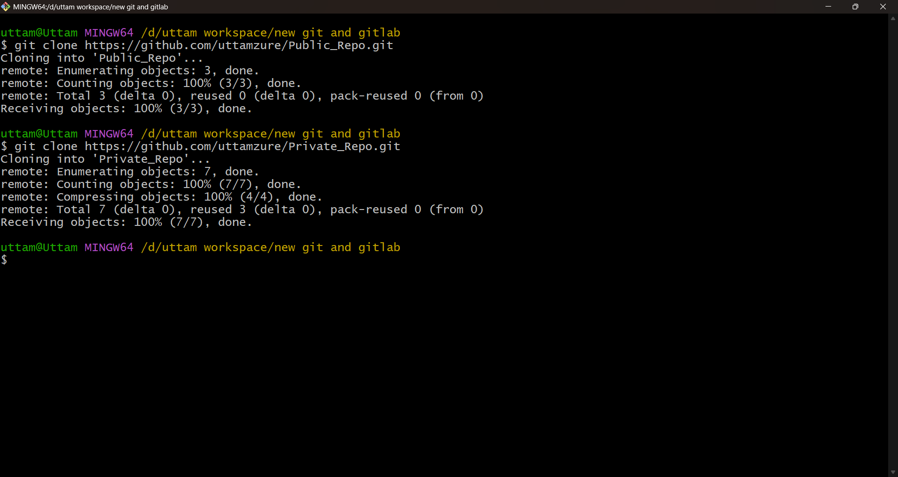
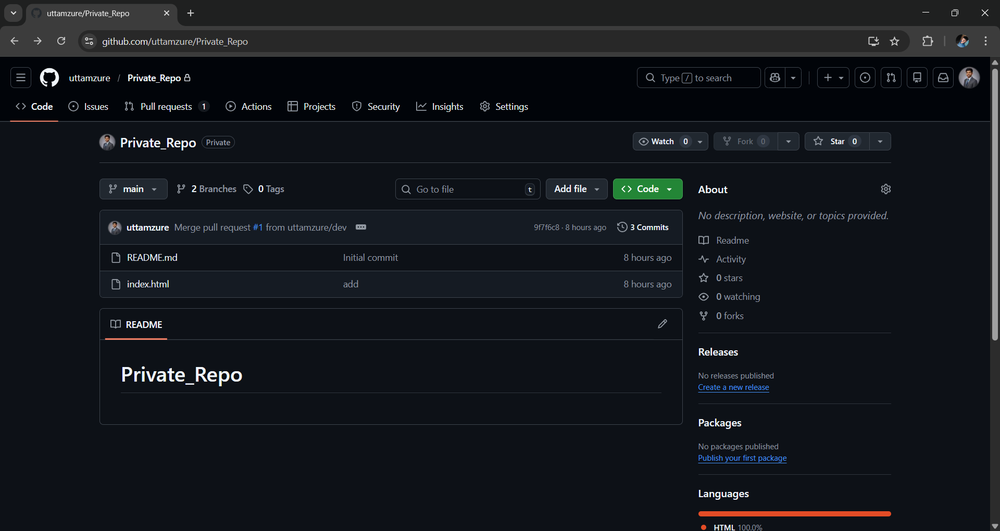
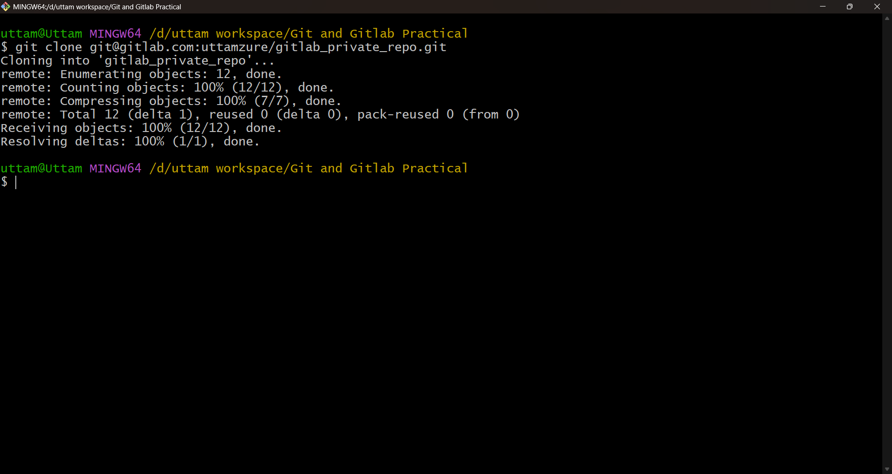
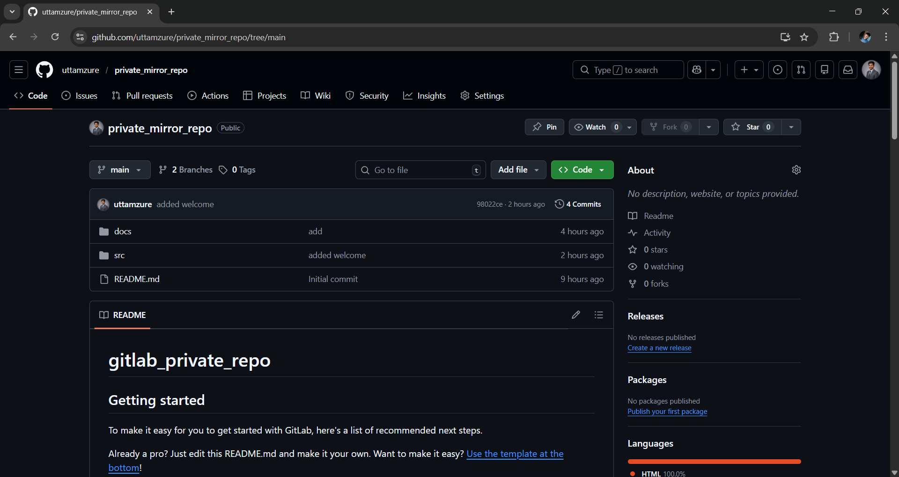
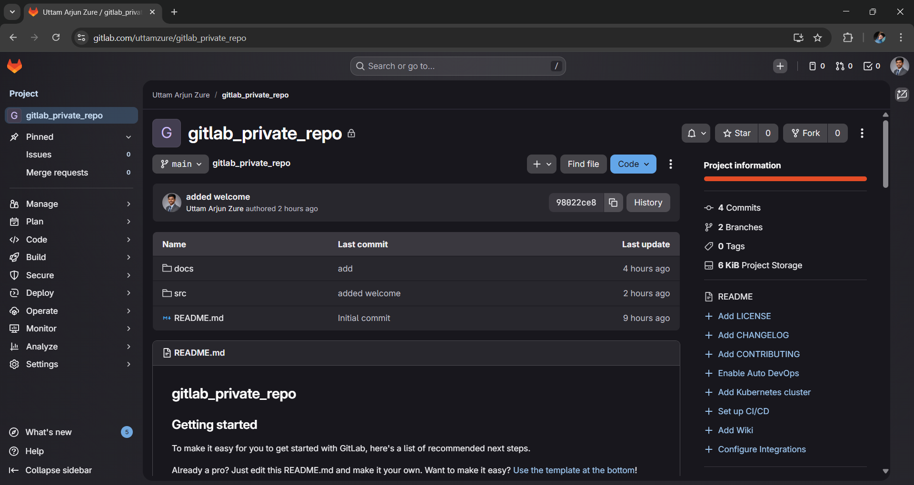
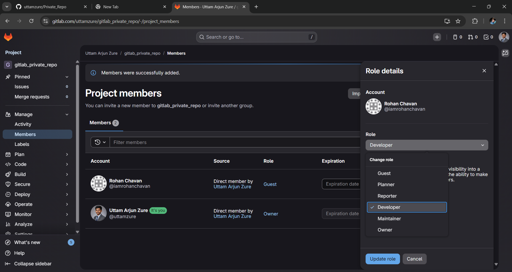

# Git and Gitlab Practical Assignment

## Part 1: GitHub Tasks

Subtask 1: Repository Setup

Create two repositories on GitHub:

* One public

* One private

## Subtask 2: Local Development
- Clone both repos on your local machine using HTTPS.
  

### In the private repo:
- Create a branch called dev .
- Add a few files (e.g., index.html , Push the readme.md ) and make at least two commits.
- dev branch to GitHub

## Subtask 3: Collaboration Workflow
- On GitHub, create a Pull Requestto merge Review and merge the PR.
Verify that changes are reflected in the dev into main .

- main branch after merging.

## Part 2: GitLab Tasks
## Subtask 4: GitLab Repository Setup
- Create a private repository on GitLab.
- Clone it on your local machine using SSH (not HTTPS)
- Create a simple project structure

## Subtask 5: Repository Mirroring
## Create a mirror setup:

- Set the GitHub private repo as the mirror of your GitLab repo.
- Push some changes to GitLab and verify if the changes reflect in GitHub automatically.
- (Optional: configure the mirror using Git remote push URL or GitLab CI if needed)
### mirroring repository

## Subtask 6: Access Control
- Invite your friend to the GitLab private repository:
- Assign them the Guest role initially, observe the access.
- Then change their role to Developer, and let them push one file

